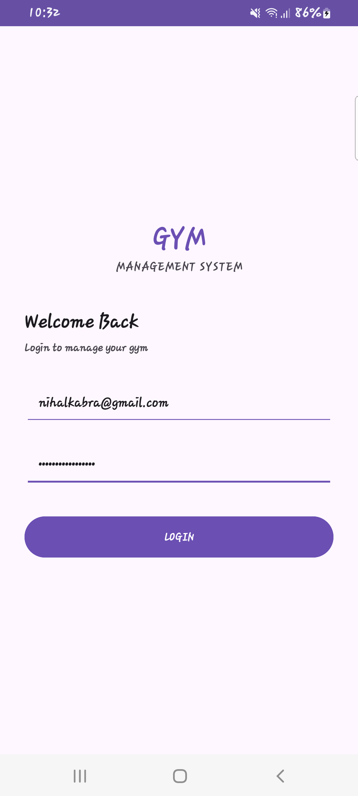
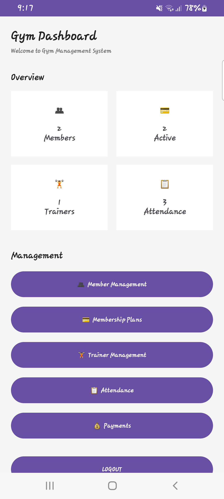
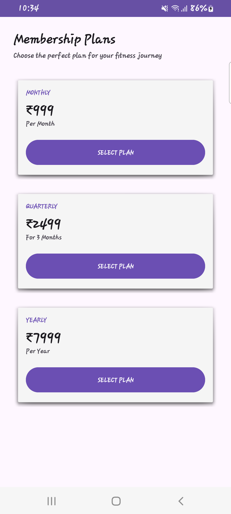
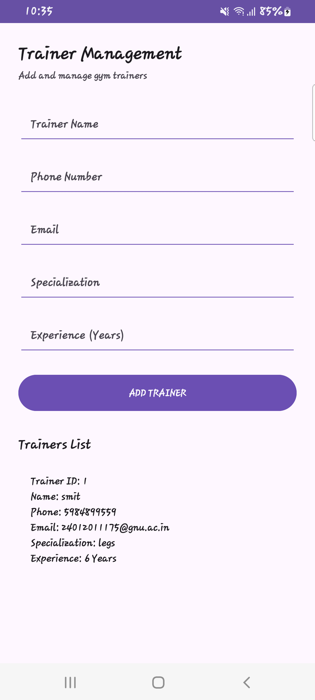
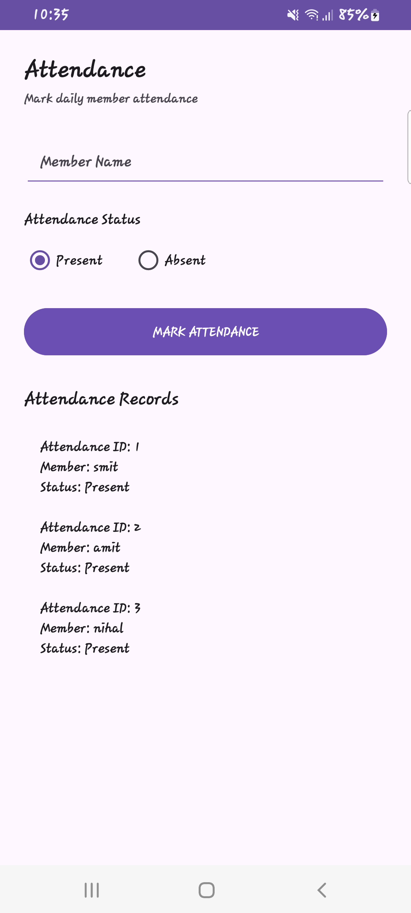
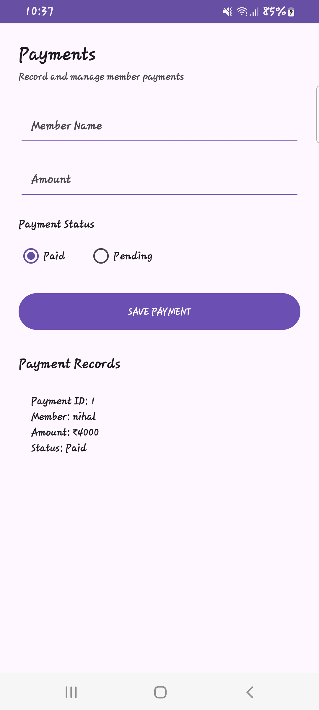

# 24012011175: Gym Management System

## AIM & Objective

To develop an Android application for managing gym members, membership plans, trainers, attendance, and payments. The application uses Kotlin and XML for development and SQLite for storing data locally.

---

# Output Screenshots

<table>
<tr>
<td align="center">

### Login



</td>

<td align="center">

### Dashboard



</td>

<td align="center">

### Member


</td>
</tr>

<tr>
<td align="center">

### Membership



</td>

<td align="center">

### Trainer



</td>

<td align="center">

### Attendance



</td>
</tr>

<tr>
<td align="center">

### Payment



</td>

<td></td>
<td></td>
</tr>
</table>

---

# Application Logic

## 1. Login Navigation

The application uses an **Explicit Intent** to navigate from the Login screen to the Dashboard.
```kotlin
val intent = Intent(
    this,
    DashboardActivity::class.java
)

startActivity(intent)
finish()
MainActivity: Used as the Login screen.
DashboardActivity: Opens after successful login.
Explicit Intent: Used to start a specific activity.
```

## 2. Dashboard

The Dashboard displays important information about the gym.
```kotlin
It shows:

Total Members
Active Members
Total Trainers
Attendance Records

The values are retrieved dynamically from the SQLite database.

memberCount.text =
    "👥\n\n${databaseHelper.getMemberCount()}\nMembers"

activeCount.text =
    "💳\n\n${databaseHelper.getActiveMemberCount()}\nActive"

trainerCount.text =
    "🏋️\n\n${databaseHelper.getTrainerCount()}\nTrainers"

attendanceCount.text =
    "📋\n\n${databaseHelper.getAttendanceCount()}\nAttendance"

The Dashboard also provides navigation to all major modules.
```

## 3. Member Management

The Member Management module allows the user to add and view gym member details.
```kotlin
The following information is stored:

Member Name
Phone Number
Email
Membership Plan
val success = databaseHelper.addMember(
    name,
    phone,
    email,
    plan
)

The member information is stored in the members table.
```
## 4. Membership Plans

The application provides three membership plans:
```kotlin
Plan	Price
Monthly	₹999
Quarterly	₹2499
Yearly	₹7999

Users can select a membership plan from the Membership screen.

btnMonthly.setOnClickListener {
    Toast.makeText(
        this,
        "Monthly Plan Selected",
        Toast.LENGTH_SHORT
    ).show()
}

Similar actions are provided for Quarterly and Yearly plans.
```
## 5. Trainer Management

The Trainer Management module allows the user to add and view trainer details.
```kotlin
The following information is maintained:

Trainer Name
Phone Number
Email
Specialization
Experience
val success = databaseHelper.addTrainer(
    name,
    phone,
    email,
    spec,
    exp
)

The trainer information is stored in the trainers table.
```
## 6. Attendance Management

The Attendance module allows the user to record member attendance.
```kotlin
The available options are:

Present
Absent
val status =
    if (present.isChecked) "Present"
    else "Absent"

databaseHelper.addAttendance(
    name,
    status
)

Attendance records are stored in the attendance table.
```
## 7. Payment Management

The Payment module allows the user to record member payment details.
```kotlin
The payment information includes:

Member Name
Amount
Payment Status

Payment status can be:

Paid
Pending
val status =
    if (paid.isChecked) "Paid"
    else "Pending"

databaseHelper.addPayment(
    name,
    paymentAmount,
    status
)

Payment records are stored in the payments table.
```

# Database Implementation

The application uses SQLite through the DatabaseHelper.kt class.
```kotlin
class DatabaseHelper(context: Context) :
    SQLiteOpenHelper(context, "GymDatabase", null, 3)

The database contains four tables.

Members Table

id
name
phone
email
membership


Trainers Table

id
name
phone
email
specialization
experience


Attendance Table

id
member_name
status


Payments Table

id
member_name
amount
status
```

# Database Logic

DatabaseHelper.kt extends SQLiteOpenHelper and is responsible for creating and managing the SQLite database.
```kotlin
The database helper provides functions to:

Add members
Retrieve members
Add trainers
Retrieve trainers
Save attendance
Retrieve attendance
Save payments
Retrieve payments
Calculate dashboard counts
Application Flow
Login
   ↓
Dashboard
   ↓
 ┌───────────────┬──────────────────┬──────────────┐
 ↓               ↓                  ↓              ↓
Members      Membership         Trainers      Attendance
                                                   ↓
                                               Payments

UI Implementation Details

Platform: Android
IDE: Android Studio
Programming Language: Kotlin
UI Design: XML
Database: SQLite
Database Helper: SQLiteOpenHelper
Navigation: Explicit Intent
User Feedback: Toast Messages
Theme: DayNight
Mode: Light and Dark Mode
Android Concepts Used
Activities
Activity Lifecycle
onCreate()
onResume()
XML Layouts
Views and Widgets
Explicit Intent
Toast Messages
Input Validation
SQLite Database
SQLiteOpenHelper
ContentValues
Cursor
SQL Queries
DayNight Theme
Data Persistence
Data Persistence

The application uses SQLite for local data persistence.

Records added by the user are stored in the local database and remain available when the application is opened again.

Testing

The following features were tested successfully:

Login validation
Dashboard navigation
Member addition
Member data retrieval
Membership plan selection
Trainer addition
Trainer data retrieval
Attendance recording
Payment recording
Dashboard count updates
SQLite data persistence
Light and Dark Mode
Navigation between activities
Project Structure
Gym Management System
│
├── MainActivity.kt
├── DashboardActivity.kt
├── MembersActivity.kt
├── MembershipActivity.kt
├── TrainerActivity.kt
├── AttendanceActivity.kt
├── PaymentActivity.kt
├── DatabaseHelper.kt
│
├── Screenshot
│   ├── Login.png
│   ├── Dashboard.png
│   ├── Attendence.png
│   ├── Member.png
│   ├── Membership.png
│   ├── Payment.png
│   └── Trainer.png
│
└── res
    └── layout
        ├── activity_main.xml
        ├── activity_dashboard.xml
        ├── activity_members.xml
        ├── activity_membership.xml
        ├── activity_trainer.xml
        ├── activity_attendance.xml
        └── activity_payment.xml

```
Student Details

Enrollment No: 24012011175

Subject: Mobile Application Development (MAD)

Conclusion

Successfully developed an Android-based Gym Management System using Kotlin, XML, and SQLite.

The application provides a simple interface for managing members, membership plans, trainers, attendance, and payments. Data is stored locally using SQLite, while Explicit Intents are used for navigation between different activities.

The application also supports data persistence and light/dark mode, providing a simple and user-friendly gym management solution.
